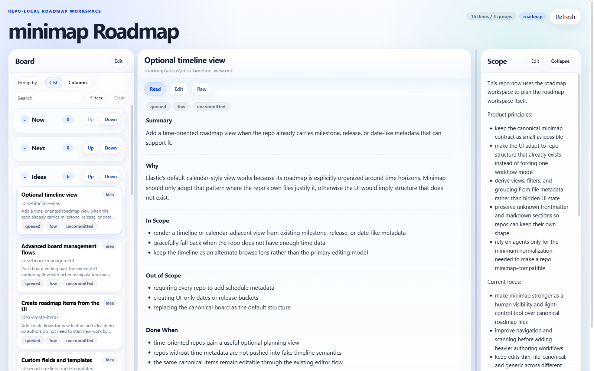
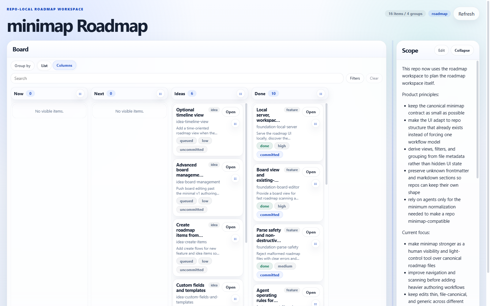
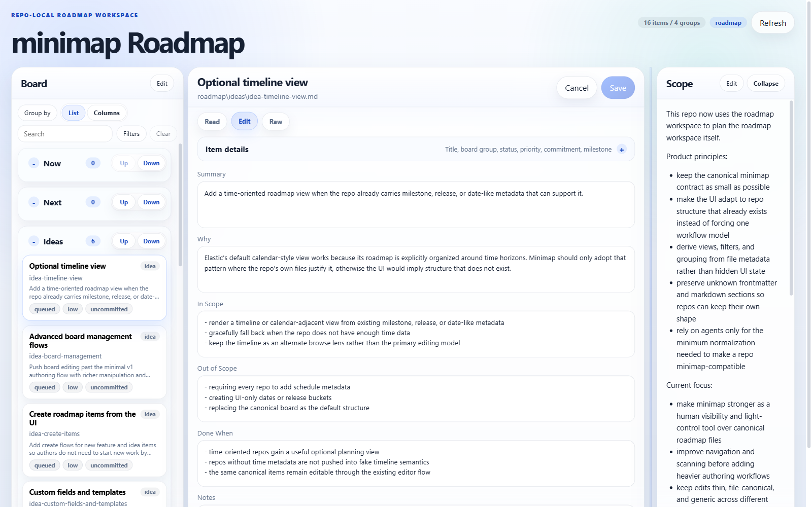

# Minimap

Planning that lives with the repo, not in chat history.

Minimap is a repo-local roadmap workspace for teams that want humans and AI agents to work from the same source of truth. It reads the roadmap files already in the repo, gives you a small local UI for browsing and editing them, and keeps git as the history.

This repo dogfoods the packaged app in `package/minimap/`, so the screenshots below are the real product as it exists here today.

## Why Use It

Minimap is for the common case where roadmap state starts drifting across chat threads, markdown files, and ad hoc planning docs.

It gives you a lightweight middle ground:

- planning stays in the repo
- humans get a local UI instead of hand-editing every file
- agents follow the same file contract and touch the same canonical files
- repo-specific structure still works without forcing a heavy PM tool or custom backend

## What It Looks Like

### Scan the roadmap without losing context

List view keeps the board, the selected item, and the current scope visible at the same time. It is the best default when you want to review work before changing it.



### Switch to a denser board when you need movement

Columns view gives you a compact kanban-style layout over the same canonical data. Safe drag-and-drop actions update the roadmap files instead of creating a second board state.



### Edit the canonical file without fighting the repo

Every item opens in read-first mode, then you can switch to structured editing for common fields or raw markdown when the repo uses a richer shape.



## What You Get

- Read-first roadmap browsing with both list and columns layouts.
- Search, filters, and alternate grouping lenses derived from metadata the repo already uses.
- Structured editing for common roadmap fields, plus raw markdown for repo-specific shapes.
- Board and scope editing that writes back to `board.md` and `scope.md`.
- Non-destructive saves that preserve unknown frontmatter keys and extra markdown sections.
- Setup guidance when a repo is missing a roadmap workspace or has an invalid path.
- A portable package that can be copied into another repo.

## How It Works

Minimap keeps one rule strict: the files are the source of truth.

- `board.md` owns groups and item order
- `scope.md` owns the current-focus narrative
- `features/*.md` owns committed or active work
- `ideas/*.md` owns uncommitted or parked work

The UI is a structured lens over those files. Git is the history. There is no database, remote sync layer, or hidden UI-only roadmap state.

Default roadmap layout:

```text
roadmap/
  board.md
  scope.md
  features/
  ideas/
```

Optional repo-root config:

```json
{
  "roadmapPath": "docs/roadmap"
}
```

## Typical Workflow

1. Start the local server from the repo root.
2. Scan the board, filter or regroup by existing metadata, and open an item in read mode.
3. Make lightweight edits in the structured editor, or switch to raw markdown when the repo needs it.
4. Commit the resulting file changes like any other repo change.

## Portable Package

The portable package lives in `package/minimap/`.

To adopt minimap in another repo:

1. Copy `package/minimap/` into that repo as `tools/minimap/`.
2. Copy `tools/minimap/templates/roadmap/` into that repo as `roadmap/`, or merge it into an existing roadmap root.
3. Optionally copy `tools/minimap/templates/roadmap.config.json` to the repo root as `roadmap.config.json` and set `roadmapPath`.
4. Run `node tools/minimap/server.js` from the host repo root.
5. Point the host repo agent instructions at `tools/minimap/SKILL.md`.

See `package/minimap/README.md` for package-focused setup and `package/minimap/CONTRACT.md` for the exact file contract.

## Run Locally

The canonical entrypoint in this repo is:

```bash
node package/minimap/server.js
```

This repo also provides a shortcut:

```bash
npm start
```

Then open the URL printed by the server. It prefers `http://localhost:4312` and falls forward to the next free port if that one is busy.

## Test

Logic and file behavior:

```bash
npm test
```

UI in a real browser:

```bash
npm run test:ui
```

First-time browser setup:

```bash
npx playwright install chromium
```
