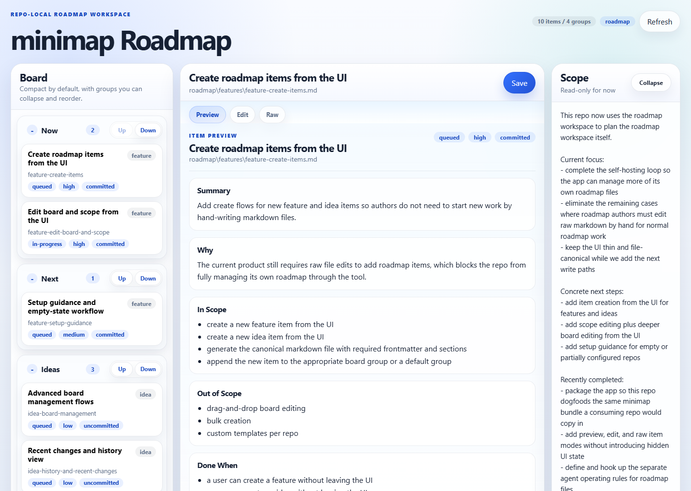

# Minimap

Planning that lives with the repo.

Minimap is a tiny repo-local, file-based roadmap and feature planning workspace for humans and agents. It keeps roadmap state in normal repo files, gives humans a local UI, and lets agents work against the same canonical source of truth.



## Why It Exists

Minimap came out of a practical loop: building projects together with AI agents, managing features through conversation, and repeatedly asking the agent to update the roadmap after each change.

That works for a while, but it stays too loose. I wanted more structure in how roadmap state is managed, and I wanted a small local UI where I could inspect the roadmap directly instead of only asking the agent what was planned, what changed, or what was next.

Minimap is meant to tighten that loop without turning it into another planning platform.

## What You Get

- roadmap and feature planning live in normal repo files
- humans get a small local UI for reading and editing those files
- agents follow the same file contract and update the same state
- git stays the history
- there is no separate database, sync layer, or hidden UI state

The item editor gives you three ways to work with the same file:
- `Preview` for reading the item as a document first
- `Edit` for common metadata and core sections
- `Raw` for uncommon metadata, extra sections, or formatting that does not fit the structured editor

## Why It Is Useful

Use minimap when you want planning to stay close to the repo instead of drifting into chat history or a separate tool.

It is especially useful when:
- a repo has an active roadmap that both humans and agents need to understand
- you want planning state to be readable in git and editable in a UI
- you want agents to update roadmap state deterministically instead of inventing their own structure
- you want something much lighter than a full project-management tool

## How It Works

Minimap keeps one rule very strict: the files are the source of truth.

- `board.md` owns groups and item order
- `scope.md` owns current-focus narrative
- `features/*.md` owns committed or active feature work
- `ideas/*.md` owns uncommitted or parked ideas

The UI is just a structured lens and editor over those files. It does not maintain separate roadmap state.

## Portable Package

A copy-in package is prepared at `package/minimap/`.

That folder is the portable bundle for other repos. It includes:
- the local app and server
- the minimap skill
- starter roadmap templates
- host-repo adoption docs
- a canonical minimap contract

To adopt minimap in another repo:

1. copy `package/minimap/` into that repo as `tools/minimap/`
2. copy `tools/minimap/templates/roadmap/` into that repo as `roadmap/` or merge it into an existing roadmap root
3. optionally copy `tools/minimap/templates/roadmap.config.json` to the repo root as `roadmap.config.json` and edit `roadmapPath`
4. run `node tools/minimap/server.js` from the host repo root
5. point the host repo agent instructions at `tools/minimap/SKILL.md`

See `package/minimap/README.md` for package usage and `package/minimap/CONTRACT.md` for the exact file contract.

## Run

The canonical minimap run command in this repo is the package entrypoint:

```bash
node package/minimap/server.js
```

This repo also provides a local shortcut:

```bash
npm start
```

Here, `npm start` just runs the same packaged server from the repo root. In a consuming repo, the equivalent command would be `node tools/minimap/server.js`.

Then open the URL printed by the server. It prefers `http://localhost:4312` and falls forward to the next free port if that one is busy.

## Test

Logic and file behavior:

```bash
npm test
```

UI in a real browser:

```bash
npm run test:ui
```

First-time browser setup:

```bash
npx playwright install chromium
```

## Repo Contract

Default roadmap root:

```text
roadmap/
  board.md
  scope.md
  features/
  ideas/
```

Optional repo-root config:

```json
{
  "roadmapPath": "docs/roadmap"
}
```

Discovery rules:
- if `roadmap.config.json` is absent, use `roadmap/`
- if it exists, resolve `roadmapPath` relative to repo root
- if the configured path is missing or invalid, the app shows a setup error

## Canonical Ownership

- `board.md` owns group names and item order
- `scope.md` owns current-focus narrative
- `features/*.md` owns detailed committed or active work
- `ideas/*.md` owns detailed uncommitted ideas

Board headings are freeform and repo-defined. Repos can group items by status, release, milestone, team, stream, or any other planning model that fits the repo.

Item files use markdown with a small core of required frontmatter and sections, but they can also carry optional metadata such as `milestone` and additional markdown sections. Minimap preserves unknown frontmatter and extra sections, and raw mode gives you an escape hatch when a repo needs richer item files.

The UI does not store separate roadmap state.
