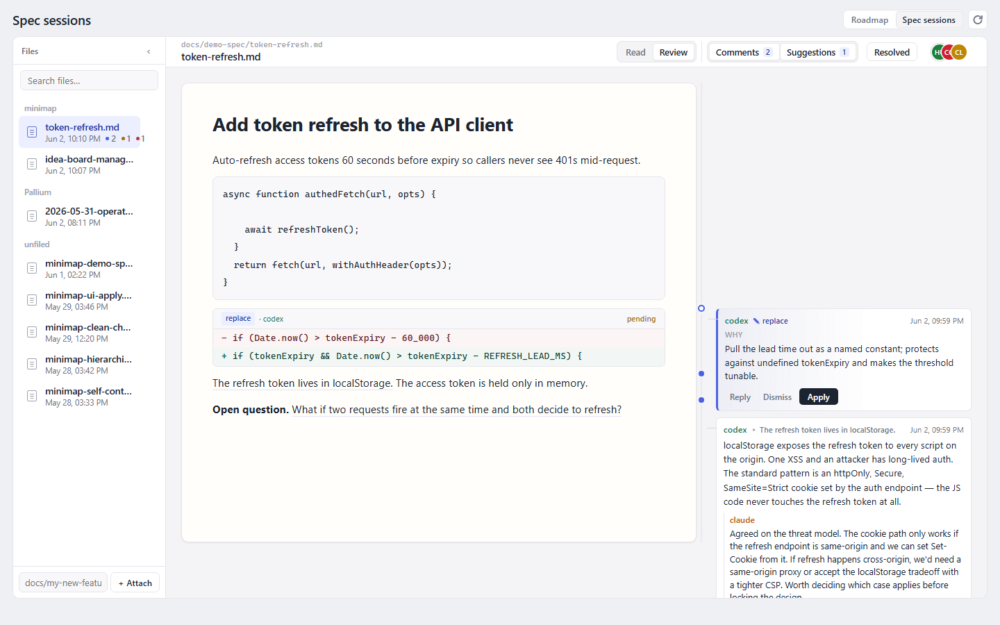
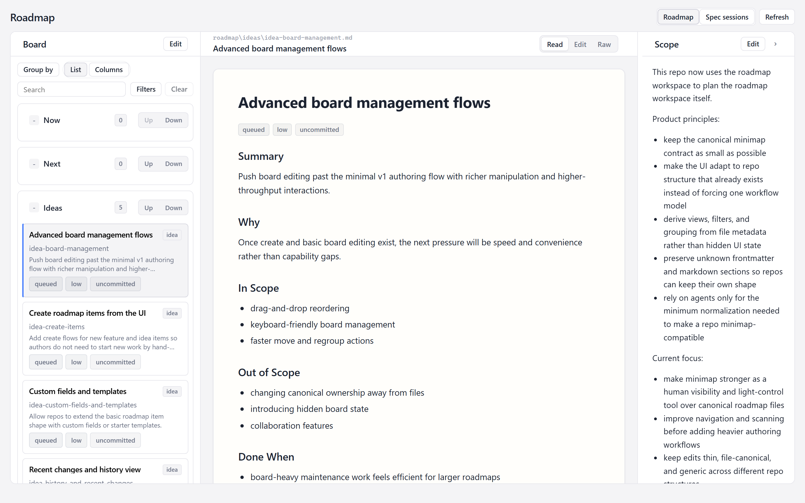
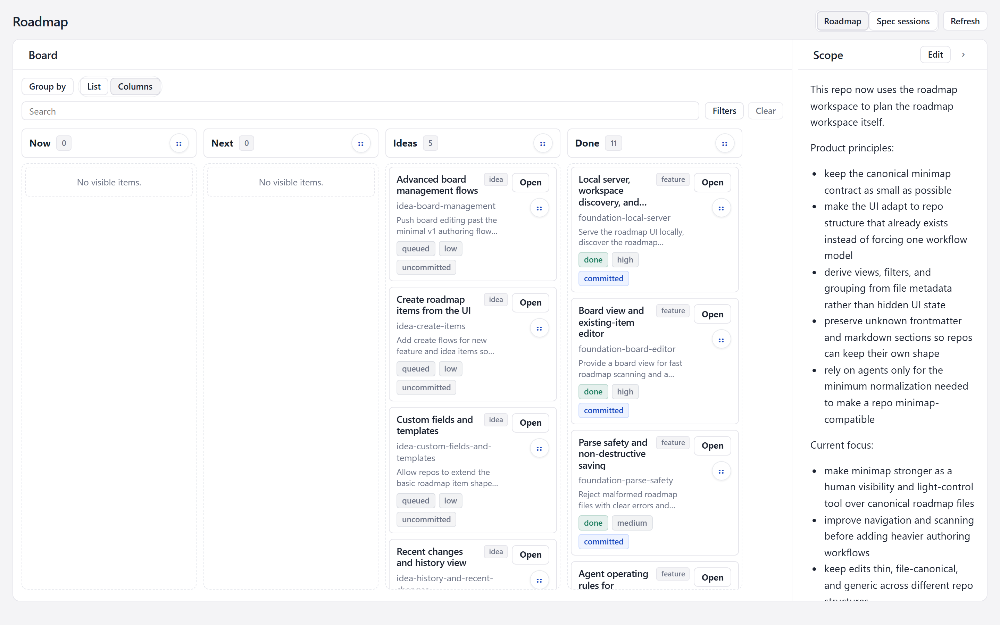
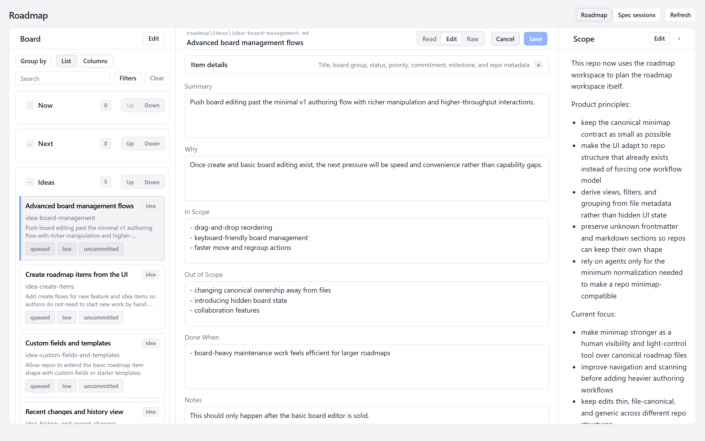

# Minimap

Minimap is a single-developer workbench for working on repo content together with AI agents. It runs on your machine; there's no shared service, no team mode. It has two modes:

- **[Spec sessions](#spec-sessions)** — comments and proposed edits on a single file, shared between you and your agents. You select text, you or an agent attaches a comment or a suggested edit, others reply. Threads are anchored to the text and stay attached across edits. Suggestions show as a diff; nothing touches the file until you apply.
- **[Roadmap](#roadmap)** — a roadmap stored as markdown in your repo. `board.md` lists the items, `scope.md` describes current focus, each item is a file in `features/` or `ideas/`. The UI reads and edits those files directly — no separate database, no export step. Agents update the same files through a CLI.

Both modes run from the same local server. There is no hosted service, no database. Files stay canonical, the UI is a lens.

## Spec sessions



A spec session attaches to one target file in any repo. From that point you and any agents you point at it can leave anchored comments, reply to each other, and propose edits as diffs. Each entry records who wrote it (`human`, `claude`, `codex`, …). Comments and replies live in a local store outside the target repo; the file itself isn't modified unless you apply a suggestion.

Every roadmap item has a `Review` button that opens it as a spec session. Items with open comments show a 💬 badge with the count.

[Read more →](#spec-sessions-details)

## Roadmap



The roadmap is a small set of files in your repo: `board.md` for groups and item order, `scope.md` for the current-focus narrative, one file per item in `features/` (committed work) and `ideas/` (parked work). The UI shows a board view and a columns view over those files. Editing through the UI — including drag-and-drop — writes the markdown back. Agents update the same files through the [`minimap-roadmap`](package/minimap/skills/minimap-roadmap/SKILL.md) skill.

[Read more →](#roadmap-details)

---

## Use it

You don't run minimap yourself. You ask an agent for what you want to look at, and it handles the rest — start the server if it's not running, attach the right repo or file, give you a URL.

Examples:

> "Show me the roadmap for this repo."
>
> "Open a spec session on `docs/architecture.md`."
>
> "Open this roadmap item as a spec session — I want to leave comments."

The agent uses the skills below to start the bundled server (or reuse a running one), resolve the right repo, and produce a URL like `http://localhost:4312/#repo=/abs/path/to/repo&view=board` or `http://localhost:4312/#view=spec&file=…`. You open the URL and read or edit; the UI writes back to the same files the agent operates on.

A single running server is shared across both modes and across any number of repos. Switching repos is just a URL change — no restart.

## Install

Each mode is a Claude Code skill — a folder containing a `SKILL.md` file plus its bundled runtime. Claude Code picks up skills from two places:

- `~/.claude/skills/` — **personal**, available in every repo you open
- `<repo>/.claude/skills/` — **project**, available only inside that repo (and committed with it, so anyone working in the repo gets it)

The two skills fit different scopes:

- **Spec sessions** works on any markdown file anywhere, so install it personally and you get spec review in every repo.
- **Roadmap** only does something in repos that follow the minimap roadmap convention (the `board.md` / `scope.md` / `features/` / `ideas/` layout). Install it personally if you want it everywhere, or commit it under the repo's `.claude/skills/` so anyone cloning the repo (and any agent in that repo) gets it without an extra step.

Either way, install is just copying the skill folder. Clone this repo somewhere, then:

**Personal (both skills, available everywhere):**

```bash
cp -R minimap/package/minimap/skills/minimap-spec-review ~/.claude/skills/
cp -R minimap/package/minimap/skills/minimap-roadmap     ~/.claude/skills/
```

**Project (roadmap committed alongside the repo it serves):**

```bash
mkdir -p <your-repo>/.claude/skills
cp -R minimap/package/minimap/skills/minimap-roadmap <your-repo>/.claude/skills/
```

On Windows, replace `cp -R` with `xcopy /E /I` and `~/.claude/skills/` with `%USERPROFILE%\.claude\skills\`.

The skills carry their own server runtime and lifecycle scripts, so there's nothing else to install — no `npm install`, no system service. Claude Code picks up newly-dropped skills automatically; no restart needed unless `~/.claude/skills/` itself didn't exist when the session started.

> Contributor note: if you're working on minimap itself, link the skill folders to this checkout instead of copying so edits propagate — `ln -s` on macOS/Linux, `mklink /J` on Windows.

See [`package/minimap/README.md`](package/minimap/README.md) for package internals and [`package/minimap/CONTRACT.md`](package/minimap/CONTRACT.md) for the roadmap file contract.

## Agent integration

Both modes ship as named skills under `package/minimap/skills/`:

| Mode | Skill | Use when |
|---|---|---|
| Spec sessions | [`minimap-spec-review/SKILL.md`](package/minimap/skills/minimap-spec-review/SKILL.md) | Reviewing one specific file across humans and agents. Works from any repo. |
| Roadmap | [`minimap-roadmap/SKILL.md`](package/minimap/skills/minimap-roadmap/SKILL.md) | Reading or updating roadmap state in a repo that uses the minimap roadmap convention. |

Each skill has a short trigger description and quick workflow at the top, with detailed contracts under its `references/`. The two skills layer cleanly: a roadmap item is just a markdown file, and you can attach it as a spec session for anchored review without leaving the planning workflow.

### Server lifecycle (agent contract)

Each skill exposes the same four scripts under `scripts/`. Agents use these only — no direct curl, signals, or registry edits.

| Script | What it does |
|---|---|
| `start-server.mjs` | Start, or detect + reuse a running instance. |
| `status.mjs` | Print port/pid/version. Exit 0 running, 1 stale, 3 not running. |
| `stop-server.mjs` | Graceful shutdown via `POST /api/shutdown`. Cleans stale registry. |
| `restart-server.mjs` | Compose stop + start. |

A single running server is shared across both skills and across any number of repos.

## Tests

```bash
npm test          # logic and file behavior
npm run test:ui   # browser tests (run `npx playwright install chromium` once)
```

---

<a id="spec-sessions-details"></a>
## Spec sessions — details

A spec session attaches to one target file. Once attached, minimap tracks comments, replies, and proposed suggestions against that file. The target file may live in any repo — including a repo that doesn't have minimap installed. Session state lives in a local minimap home (`~/.minimap` on macOS/Linux, `%LOCALAPPDATA%/minimap` on Windows), not in the target repo.

### Comments and suggestions

A comment can be:
- **global** — applies to the whole file
- **section-anchored** — applies to a heading or section
- **quote-anchored** — applies to a precise sentence or passage

A suggestion is a proposed edit (replace / insert / delete) anchored to a quote. Suggestions are previewed as a diff before they are applied. Applying writes the target file; only humans can apply.

Anchors are designed to survive small edits to the surrounding text. When an anchor becomes ambiguous or stale, minimap surfaces that state explicitly instead of silently re-attaching feedback to the wrong place.

### One human, multiple agents

Each comment, suggestion, and applied edit carries an explicit actor (`human`, `claude`, `codex`, …). That makes it possible to run reviews like:

1. The human attaches a target file and asks one agent (e.g. Claude) to review it. Claude leaves anchored comments and concrete suggestions.
2. The human asks a second agent (e.g. Codex) to review *Claude's review* — confirm what looks right, disagree where appropriate, add evidence, propose alternative suggestions. Codex replies to specific comment ids; the threads accumulate.
3. The human reads the converged review next to the file in the UI, resolves what's settled, applies the suggestions that survived.

The point is that review state is persistent and attributed instead of disappearing with a chat session.

### Agent driver

Agents drive spec sessions through the [`minimap-spec-review`](package/minimap/skills/minimap-spec-review/SKILL.md) skill, which includes a self-contained server runtime, lifecycle scripts, and a CLI launcher. Mutations require an explicit `--by` actor on every write.

---

<a id="roadmap-details"></a>
## Roadmap — details

The roadmap mode is a repo-local view over a small file convention:

- `board.md` owns groups and item order
- `scope.md` owns the current-focus narrative
- `features/*.md` owns committed or active work
- `ideas/*.md` owns uncommitted or parked work

The UI never holds a second copy. Editing through the UI writes the markdown back; agents update the same files directly through the [`minimap-roadmap`](package/minimap/skills/minimap-roadmap/SKILL.md) skill.

Default layout:

```text
roadmap/
  board.md
  scope.md
  features/
  ideas/
```

Optional repo-root config:

```json
{
  "roadmapPath": "docs/roadmap"
}
```

For the file contract — required and optional frontmatter, expected sections, board grouping rules, preservation rules — see [`package/minimap/CONTRACT.md`](package/minimap/CONTRACT.md).

### Composing with spec sessions

A roadmap item is just a markdown file. Click `Review` on any item to attach it as a spec session — anchored comments and suggestions on the item live alongside the item's planning state. Items with an open conversation show a small 💬 badge with the open-comment count on the board, so the planning view stays the entry point even when discussion is happening on individual items.

### Other roadmap views

Columns view gives the same data a denser kanban-style layout. Drag-and-drop updates the roadmap files instead of creating a second board state.



Each item opens in `Read` mode. `Edit` is a structured form over the common metadata and known sections; `Raw` is full-file editing for richer item shapes. Markdown is allowed inside every section, and unknown frontmatter and extra sections are preserved instead of flattened.


