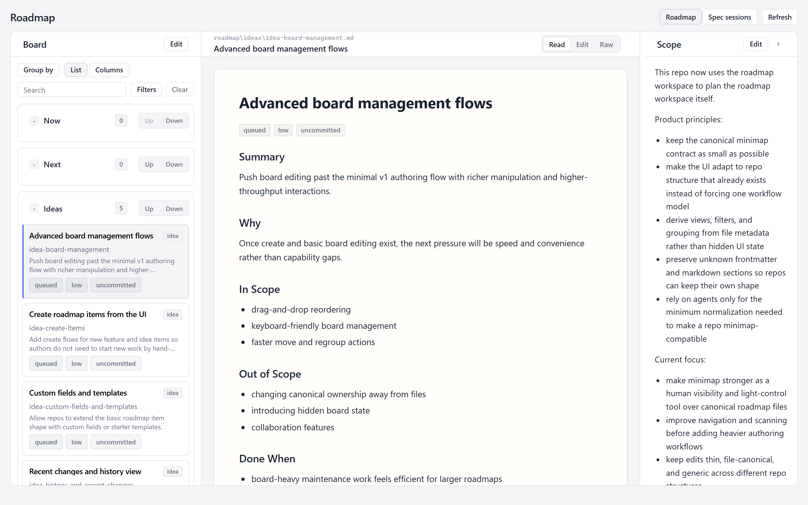
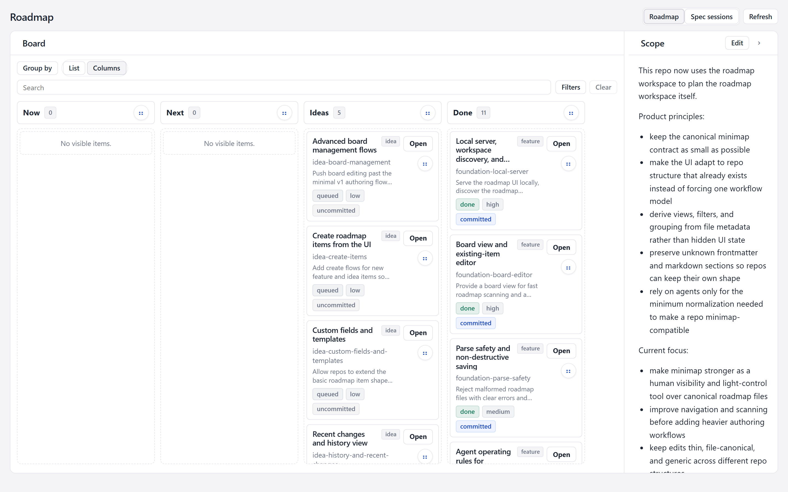
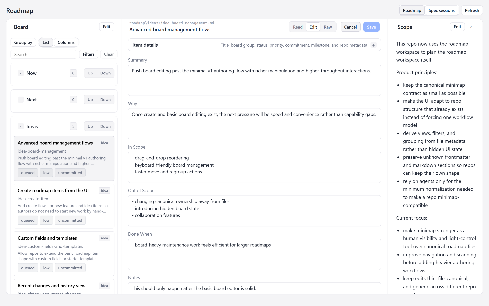
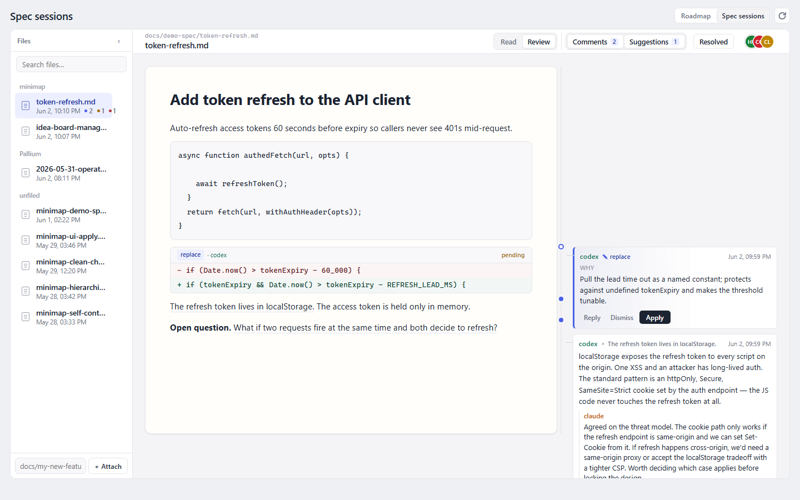

# Minimap

Minimap is a local workbench for one developer working with AI agents on markdown files. It provides two views:

- **[Roadmap](#roadmap)** — browse and edit a file-based roadmap, including features being worked on in separate Git worktrees.
- **[Spec sessions](#spec-sessions)** — review a markdown file with anchored comments, replies, and proposed edits that you preview before applying.

Your files remain the source of truth. One local server serves both modes across repositories. There is no hosted service or shared team account; review discussions are stored locally outside the target repository.

> Part of the [Rore collection](https://github.com/rore/rore-collection): local tools for developers working with coding agents.

[Get started](#get-started) · [Roadmap](#roadmap) · [Spec sessions](#spec-sessions) · [Agent guide](#agent-guide) · [Development](#development)

## Get started

### Install the skills

You need Node.js available on your path; this repository's CI uses Node.js 22. Git is needed for worktree discovery. Each mode ships as a self-contained skill folder with instructions, runtime, and scripts. Using an installed skill requires no `npm install` or system service.

Clone this repository and copy either or both folders into your agent client's skill directory. For example, for a personal Claude Code installation, run these commands from the cloned repository:

```bash
mkdir -p ~/.claude/skills
cp -R package/minimap/skills/minimap-roadmap ~/.claude/skills/
cp -R package/minimap/skills/minimap-spec-review ~/.claude/skills/
```

PowerShell equivalent:

```powershell
New-Item -ItemType Directory -Force "$HOME/.claude/skills" | Out-Null
Copy-Item -Recurse package/minimap/skills/minimap-roadmap "$HOME/.claude/skills/"
Copy-Item -Recurse package/minimap/skills/minimap-spec-review "$HOME/.claude/skills/"
```

For a project-scoped Claude Code installation, use `<your-repo>/.claude/skills/` instead. For another agent client, use its supported skill location or point its instructions at the relevant `SKILL.md`. Follow your client's procedure for discovering newly installed skills.

**Spec sessions** works with any markdown file. **Roadmap** uses the [file convention below](#file-layout-and-configuration). Add a pointer to the installed skills in your repository's agent instructions; [AGENTS_SNIPPET.md](package/minimap/AGENTS_SNIPPET.md) provides an example whose paths you can adapt.

### Open a view

Ask your agent:

> “Show me the roadmap for this repo.”
>
> “Open a spec session on `docs/architecture.md`.”
>
> “Show the roadmap across this repo's worktrees.”

The agent starts or reuses the local server and gives you a browser URL. You can also start it yourself using either installed skill:

```bash
node <path-to-skill>/scripts/start-server.mjs
```

Use the port printed by the launcher; the default is 4312. Roadmap URLs identify the repository explicitly:

```text
http://localhost:4312/#repo=/absolute/path/to/repo&view=board
```

Use forward slashes for Windows paths and URL-encode the path when necessary. Spec sessions require an attach step; the [spec-review skill](package/minimap/skills/minimap-spec-review/SKILL.md) provides the command and URL format. Switching repositories does not require restarting the server.

<a id="roadmap-details"></a>

## Roadmap



The board reads markdown files in your repository. **List** and **Columns** show the same items; grouping can follow the board or metadata such as milestone or lane. Editing an item or dragging it in an editable checkout writes back to those files. Agents edit the same files directly.

**Unfinished** narrows the board to unfinished statuses. **In play** includes items with status `active` or `in-progress`, or confirmed attached, nonclosed agent sessions—including dormant sessions. It combines with the other filters, so those can still hide matching items. When participant information is unavailable, known active and in-progress items remain visible with an incomplete-results notice.

Columns can be collapsed to give other groups more room:



Each item opens in **Read** mode. **Edit** provides a form; **Raw** edits the markdown. Unknown metadata and extra sections are preserved. **Review** opens the item as a spec session, and a comment badge indicates open discussion.



### Working across Git worktrees

Agents working in separate worktrees may update different copies of the roadmap. Use the picker beside the repository name to switch between **This checkout** and **Across worktrees**.

Across combines local checkout versions into one read-only board. It uses Git ancestry to identify shared features and flags differences between versions; these differences do not necessarily mean Git has a merge conflict. Open an item and choose a checkout version to inspect or edit it. Save changes only that checkout and rejects stale files or changed checkout identities. Minimap does not merge or synchronize roadmap files, and board reordering is disabled in the combined view.

The opened checkout appears first while other worktrees load. Counts and **In play** results are provisional during that time; participant information waits for the full scan. Refresh keeps the existing board, session badges and editor usable. If a consistent worktree snapshot cannot be read, Minimap retries twice automatically while showing the loading indicator. Persistent failures retain the last usable view with a stale notice and a Refresh retry.

Only local linked Git worktrees are included, not separate clones or remote branches. The combined view currently loads at most **16 checkouts**. **Partial coverage** means some sources were excluded—for example, because of that limit or an unreadable roadmap. Expand the board summary for the reasons. Counts describe loaded sources, and a feature can appear in multiple groups when its versions differ.

### File layout and configuration

The default layout is:

```text
roadmap/
  board.md       # groups and shared item order
  scope.md       # current focus
  features/      # one markdown file per feature
  ideas/         # one markdown file per idea
```

Item metadata holds status, priority, lane, milestone, and similar classifications. `board.md` holds the shared manual order; use a neutral `# Items` group when you want metadata-based grouping with unrestricted shared ordering. Git records file history.

An optional **`roadmap.config.json`** at the repository root changes the location and available views:

```json
{
  "roadmapPath": "docs/roadmap",
  "defaultLens": "lane",
  "filters": {
    "fields": ["owner", "team"]
  },
  "lenses": {
    "fields": {
      "lane": { "order": ["Product", "Platform", "Operations"], "draggable": true },
      "milestone": { "order": ["M1", "M2", "Later"] }
    }
  }
}
```

Here, a *lens* means a grouping. `defaultLens` sets the initial grouping independently of List/Columns layout; an explicit URL grouping takes precedence. `filters.fields` adds project-specific metadata filters. See the [roadmap contract](package/minimap/CONTRACT.md) for item format, ownership, and editing rules, and the [roadmap skill](package/minimap/skills/minimap-roadmap/SKILL.md) for setup and updates.

### Optional Pallium participants

With Pallium configured, roadmap items show **Recent** and **Dormant** attached sessions. “Recent” refers to the session's last-seen time within Pallium's 24-hour window, not proof that an agent is working on this feature now. The item panel separates lifecycle groups and shows last-seen information. Missing or partial results are not shown as zero participants.

Lookup is read-only and bounded to 200 features per request. Completed items normally omit board badges; **In play** can include them when the other filters allow it. Their sessions remain accessible in the item panel. Board and detail observations may differ because they refresh at different times.

To enable lookup, supply `MINIMAP_PALLIUM_ENDPOINT` as an explicit local HTTP origin when starting or restarting the server. Exact-session links require a separate compatible `MINIMAP_PALLIUM_DASHBOARD_ENDPOINT`. Successful lifecycle commands remember these settings. Without configuration, Minimap makes no Pallium requests.

Minimap does not detach sessions or manage assignments. Supported links lead to Pallium's controls; associations do not guarantee a complete historical participation record. See [participant integration](package/minimap/skills/minimap-roadmap/references/pallium-participants.md) for compatibility, configuration, and agent work references.

<a id="spec-sessions-details"></a>

## Spec sessions



A spec session attaches to one markdown file in any repository. You and your agents can leave whole-document, section, or quote comments, reply in threads, and propose edits. Suggestions display a diff before application; discussion alone does not modify the file.

Anchors track text across edits. If a target becomes ambiguous or cannot be found, Minimap surfaces that state instead of silently attaching feedback elsewhere. Each entry records an actor label such as `human`, `claude`, or `codex`; this is attribution, not authentication.

A typical review:

1. Ask one agent to review the file and leave anchored comments or suggestions.
2. Ask another agent to review those findings and reply in the same threads.
3. Read the discussion, resolve settled threads, and apply the suggestions you approve.

Comments and suggestions live outside the repository in the local Minimap home: `~/.minimap` on macOS/Linux or `%LOCALAPPDATA%/minimap` on Windows, unless `MINIMAP_HOME` overrides it. They are not distributed by committing the target file. The [spec-review skill](package/minimap/skills/minimap-spec-review/SKILL.md) documents attach, comment, preview, and apply commands.

<a id="agent-integration"></a>

## Agent guide

Start with the skill matching the task; its references contain the detailed CLI and API contracts.

| Task | Entry point |
|---|---|
| Show, create, or update a roadmap; pick up, resume, investigate, test, or complete assigned roadmap work | [minimap-roadmap/SKILL.md](package/minimap/skills/minimap-roadmap/SKILL.md) |
| Review or comment on a markdown file | [minimap-spec-review/SKILL.md](package/minimap/skills/minimap-spec-review/SKILL.md) |
| Add repository instructions | [AGENTS_SNIPPET.md](package/minimap/AGENTS_SNIPPET.md) |
| Understand roadmap file ownership | [CONTRACT.md](package/minimap/CONTRACT.md) |

For roadmap work, resolve `roadmap.config.json` first, edit the assigned checkout's canonical files, preserve unknown metadata, and reconcile the owning feature when work completes. The combined board does not authorize copying changes between worktrees or create a second roadmap tracker.

For spec review, read the target file and existing discussion before adding feedback. Use the documented CLI or API; preview suggestions and obtain explicit user approval before applying them. This is workflow policy, not an enforced permission check. CLI mutations require an explicit `--by` actor label.

### Server lifecycle

Both skills expose these scripts under `scripts/`. Use them for lifecycle operations instead of launching `server.js` directly, sending process signals, or editing the registry.

| Script | Purpose |
|---|---|
| `start-server.mjs` | Start or reuse a compatible running server. |
| `status.mjs` | Report live identity, participant settings, and lifecycle diagnostics; exits 0 running, 1 stale, 3 not running. |
| `stop-server.mjs` | Gracefully stop the server or clean a stale registry. |
| `restart-server.mjs [--replace-runtime]` | Restart; replacing a different or unknown runtime requires explicit opt-in. |

The server is shared across repositories and both modes. Coordinate before replacing it: replacement interrupts all clients and can downgrade the running version. Updating an installed skill's files does not restart the server. See [server lifecycle](package/minimap/skills/minimap-roadmap/references/server.md) for compatibility, configuration, and diagnostics.

### Local access boundary

The server binds to `127.0.0.1`. Requests must use loopback addresses and a loopback `Host`; browser `Origin` must match the request origin. Minimap has no user authentication or remote team access. Actor labels and participant associations do not grant permissions.

## Development

From a cloned repository:

```bash
npm ci
npx playwright install chromium
npm test
npm run test:ui
```

Read [AGENTS.md](AGENTS.md) before changing the implementation. `package/minimap/` is the source of truth; each skill's `runtime/` is generated. After changing server, CLI, UI, or runtime code, run:

```bash
node scripts/sync-mirrors.mjs
```

Do not edit the runtime mirrors by hand. Update affected skill documentation alongside behavior changes; mirror synchronization does not update prose. Contributors can link installed skill folders to this checkout instead of copying them. See the [package README](package/minimap/README.md) for the package layout.
